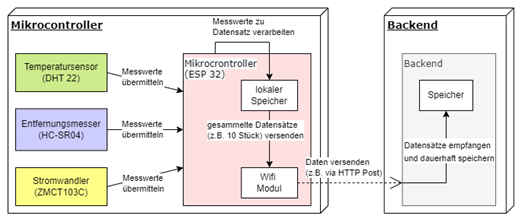
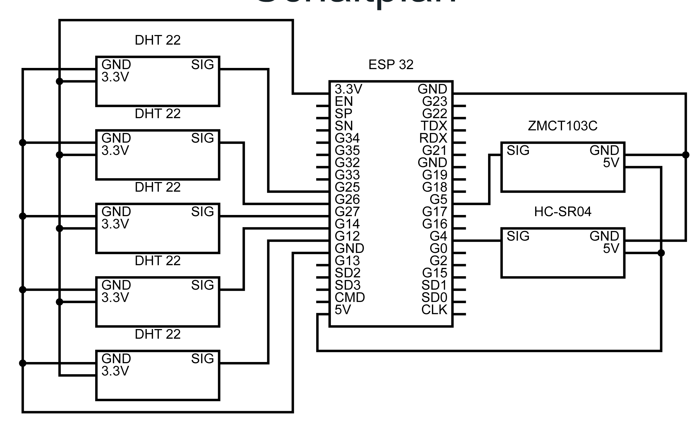

# FridgeLogger
## The myth of the open refrigerator - how much energy is getting lost

 An ESP32 based measuring device for a domestic refrigerator.
 The purpous is to analysing the correlation between the refrigerators energy conmsumption and the door openings.
#### Software concept

#### Hardware concept

## Build
### Software (Google Apps Script)
#### 1. Create a new Google Sheets document.
#### 2. Add Google Apps Script to a Google Sheets file [Connecting Google Apps Script](https://developers.google.com/apps-script/guides/sheets#connecting_to_google_forms)
#### 3. Paste the code in your Google Apps script.gs file [Script](Google%20Apps%20Script/loggerBackend.js).

### Software (ESP32)
#### 1. Install [PlatformIO](https://platformio.org/platformio-ide) extension.
#### 2. Configure your Wifi [setupWifi.h](ESP32/src/espService/setupWifi.h).
#### 2. Configure your Google Script endpoint [HTTP endpoint](https://github.com/jaklPhil/FridgeLogger/blob/2461b9a289d12748e377009df085bbd735967b8e/ESP32/src/dataService/httpService.cpp#L6).
#### 3. Connect your ESP32 an run PlatformIO "upload". 

### Hardware
#### Components
| Description         | Component   | amount  	   |
| ------------------- |-------------|-------------|
| Microcontroller     | ESP32       | 1           |
| temperature sensor  | DHT22       | 5           |
| Distance sensor     | HC-SR04     | 1           |
| Current transformer | ZMCT103C    | 1           |

#### Wiring diagramm

