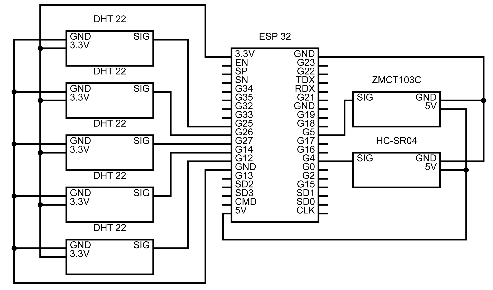

# FridgeLogger
 An ESP32 based measuring device for a houshold Fridge.
 The Purpous is to analysing the correlation between door openings and energy conmsumption.
## Software concept

## Hardware setup

## Wiring diagramm

